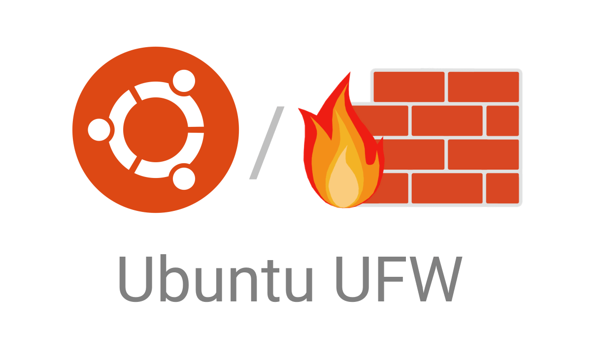

# How to Setup a Web Server in VirtualBox and Ubuntu Server
## Introduction
This is a guide that will walk you through the process of setting up a basic web server using Ubuntu Server and Apache. You'll learn how to install VirtualBox, set up an Ubuntu Server VM, install Apache, configure a firewall, and deploy your web server. 
## Basic Terminology a Reader Must Know

### VirtualBox

 **VirtualBox**: A free and open-source virtualization software for running virtual machines. 
### Ubuntu

**Ubuntu**: is a version of the Ubuntu operating system designed and engineered as a backbone for the internet. 
### Apache

**Apache**: a free, open-source web server that delivers web content over the internet
### SSH

**SSH**: Secure Shell, is a network protocol that allows secure communication between two computers over an unsecured network
### Firewall

**Firewall**: A network security system that monitors and controls incoming and outgoing network

## Step-by-Step Instructions 

### Step 1: Install VirtualBox
First, install VirtualBox, it allows us to create a virtual machine on your computer for running Ubuntu Server. 

#### Instructions: 

1. Download VirtualBox from [here](https://www.virtualbox.org/). 

2. Follow the installation instructions specific to your operating system. 

### Step 2: Installing Ubuntu Server 

Next, install Ubuntu Server on the VirtualBox VM. 

  
#### Instructions: 

1. Download the latest Ubuntu Server ISO  [here](https://ubuntu.com/download/server). 

2. Open VirtualBox, click on **New**, and select the OS type as **Linux** and version as **Ubuntu (64-bit)**. 

3. Follow the steps to create a new virtual machine, assigning memory (RAM) and storage. 

4. Once the VM is created, go to **Settings** > **Storage**, and attach the downloaded Ubuntu Server ISO. 

5. Start the VM and follow the installation prompts to install Ubuntu Server. Make sure to set up the SSH server during installation. 

### Step 3: Installing Apache 

Now install Apache, the web server software.
  

#### Instructions: 

1. Log into your Ubuntu Server using SSH or directly on the VM. 

2. Update the package index: 
   
    `sudo apt update` 
3. Open your terminal, enter the following command at the terminal prompt:
   
   `sudo apt install apache2`  
4. To verify the Apache installation enter the following:
   
   `apache2 -v`

### Step 4: Setting up the Firewall

 Ubuntu uses **ufw** to mange firewall rules.

### Instructions 

1. To enable **ufw**, run the following command from terminal prompt:
   
   `sudo ufw enable`

2. To disable it, use the following command:
   `sudo ufw disable `

3. To check on the status of firewall 
   `sudo ufw status` 
