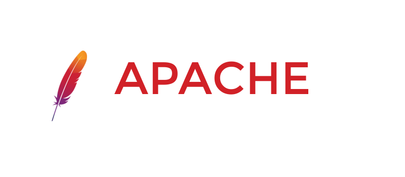
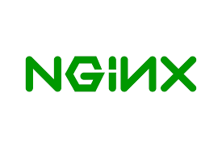
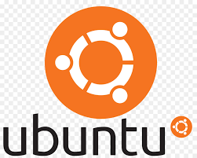

--- 
name: Holly Martinez 
course: cis106 
semester: fall 24 
--- 
# Deliverable 1 

> Tutorial can be found [here](https://www.digitalocean.com/community/tutorials/how-to-install-the-apache-web-server-on-ubuntu-22-04)

## Concepts I don't understand:

* **apache:** a free open source web server software that allows users to view on a website
* **UFW:** stands for "Uncomplicated Firewall" a program a netfilter firewall designed to be easy to use.It uses a command-line interface consisting of a small number of simple commands, and uses iptables for configuration. UFW is available by default in all Ubuntu installations 

### What is a web server? Hardware and software side
 A web server is a combination of hardware and software that uses protocols like HTTP (Hypertext Transfer Protocol) to store, process, and deliver webpages to users.
   * **hardware** a web server stores web server software and a website's component files (for example, HTML documents, images, CSS stylesheets, and JavaScript files). A web server connects to the Internet and supports physical data interchange with other devices connected to the web. 

   * **software** a web server includes several parts that control how web users access hosted files. At a minimum, this is an HTTP server. An HTTP server is software that understands URLs (web addresses) and HTTP (the protocol your browser uses to view webpages). An HTTP server can be accessed through the domain names of the websites it stores, and it delivers the content of these hosted websites to the end user's device. 
### What are some different web server applications?
| Application Name | License              | Project's Website |
| -----------------|----------------------|-----------------------------------|
| Apache           | Apache License 2.0   |[Apache](https://httpd.apache.org/)
| Nginx            | BSD 2-Clause License |[nginx](https://nginx.org/)
| Caddy            | Apache License 2.0.  |[caddy](https://caddyserver.com/)

#### Apache
 
The reason for Apache’s dominance is threefold: an open license, early entry (this thing was released way back in 1995!), and easy deployment of PHP. The last point was made possible through the `mod_php` module, which meant that installing Apache was all you needed to do for developing with PHP. 
#### Nginx
 
It was released as a project in 2002 by a Russian engineer who got fed up with the then-present solutions’ inability to beat the `CK10` problem (basically, handling thousands of concurrent connections). 
#### Caddy
 
Caddy, a modern web server known for its automatic HTTPS setup, is licensed under the Apache License 2.0. This is a permissive open-source license, which allows you to freely use, modify, and distribute the software.
### What is virtualization?
Virtualization is creating virtual versions of something. Virtualization allows administrators to divide the hardware and create multiple computers inside a single physical computer. It is an old concept however it has gain popularity due to the availability of faster, better and cheaper hardware.
### What is virtualbox?
 
Virtualbox is a powerful x86 and AMD64/Intel64 virtualization product for enterprise as well as home use. It is an Open Source Software that is freely available, extremely feature rich, high performance product. 
### What is a virtual machine?
A virtual machine is a software-based computer that functions like a physical computer. VMs can run programs, store data, and connect to networks. They are created from a pool of hardware resources and are isolated from the rest of the system by a hypervisor.
### What is Ubuntu Server?
 
Ubuntu Server is a part of the larger set of Ubuntu products and operating system developed by Canonical Ltd. Ubuntu server is a specific addition that differs a little bit from Ubuntu desktop, in order to facilitate installation on servers. 
### What is a firewall?
 Firewall is a cybersecurity solution that protects your computer or network from unwanted traffic coming in or going out. 
 
### What is SSH?
SSH (Secure Shell or Secure Socket Shell) is a network protocol that gives users -- particularly systems administrators -- a secure way to access a computer over an unsecured network. 
