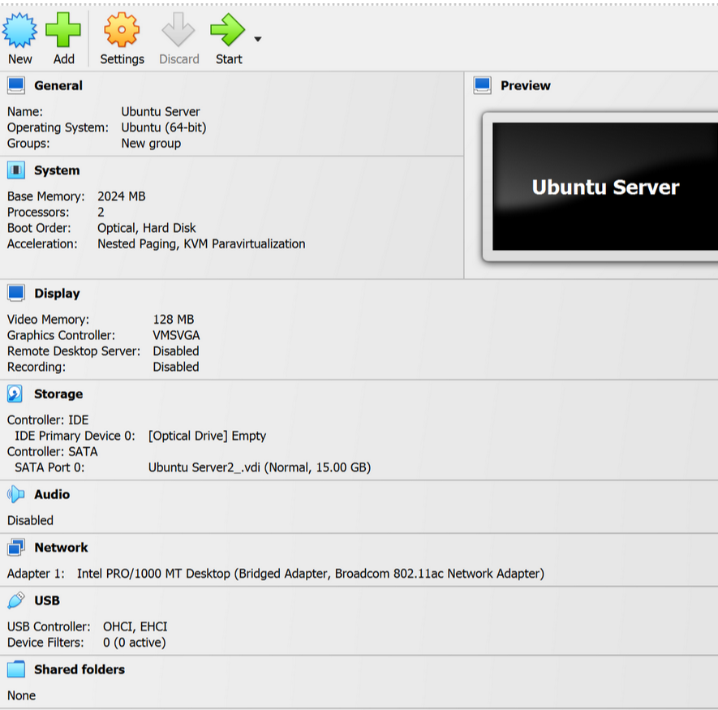
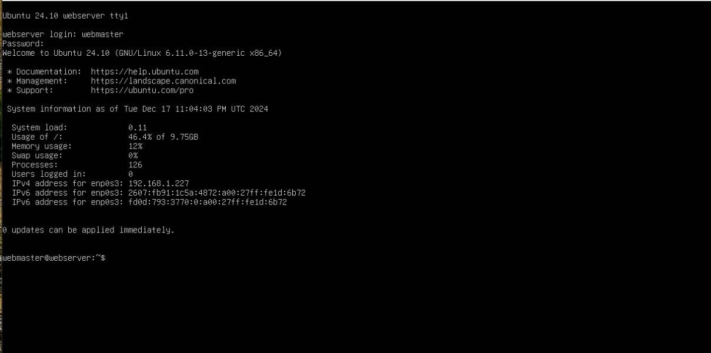

--- 
name: Holly Martinez 
course: cis106 
semester: fall 24 
--- 
# Deliverable 2 Submission

## What are the server hardware specifications?

## What is Ubuntu server log in screen? 

## What is the IP address of your Ubuntu Server Virtual Machine?
`192.168.1.227`
## How do you enable the Ubuntu Firewall?
`sudo ufw enable`
## How do you check if the Ubuntu Firewall is running?
`sudo ufw status`
## How do you disable the Ubuntu Firewall?
`sudo ufw disable`
## How do you add Apache to the Firewall?
`sudo ufw allow 'Apache'`
## What is the command you used to install Apache?
`sudo apt install apache2`
## What is the command you use to check if Apache is running?
`sudo systemctl status apache2 --no-pager`
## What is the command you use to stop Apache?
`sudo systemctl stop apache2`
## What is the command you use to restart Apache?
`sudo systemctl restart apache2`
## What is the command used to test Apache configuration?
`sudo apachectl configtest`
## What is the command used to check the installed version of Apache?
`sudo apache2 -v`
## What are the most common commands to troubleshoot Apache errors? Provide a brief description of each command.
- **systemctl** - Used to control and interact with Linux services via the systemd service manager.
- **journalctl** - Used to query and view the logs that are generated by systemd.
- **apachectl** - When troubleshooting, this command is used to check Apache’s configuration.
## Which are Apache Log Files, and what are they used for? Provide examples and screenshots.
**Apache Log Files** - helpful resources for troubleshooting, any error that you receive in a browser or other HTTP client will have a corresponding entry in Apache’s logs. Sometimes Apache will also output errors related to configuration, built-in modules, and other debugging information to its log files.