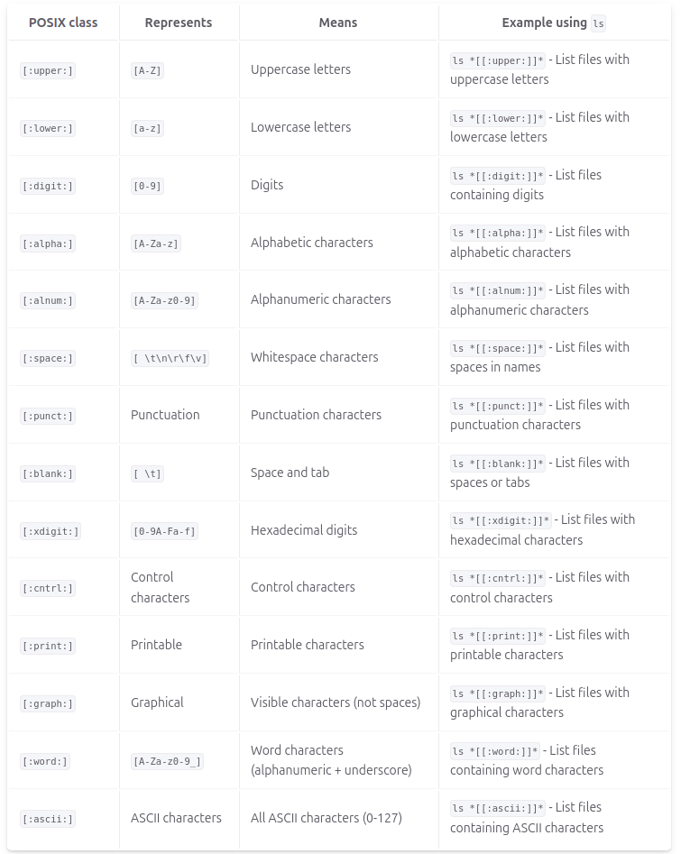

# Notes 6

## * Wildcard
    * matches 0 to any number of characters
### Example:
    * ls -1d wildcard_extra_practice/*/

    * mv wildcard_extra_practice/*.sh wildcard_extra_practice/scripts/

    * mkdir wildcard_extra_practice/images/

## ? Wildcard
    * matches 1 character 
### Example:
    *  ls -1X wildcard_extra_practice/*.????

    * ls -1X wildcard_extra_practice/i*.????

    * ls -1X wildcard_extra_practice/*.???x

## [] WIldcard
    * matches 1 character from a set
### Example:
    * ls *[[:upper:]]* 
    * ls *[[:lower:]]*
    * ls *[[:digit:]]*
    * ls f[a-z]*
    
## Brace Expansion
    * allows you to generate aribiturary strings to use with commands
### Example:
    * mkdir -p music/{jazz,rock}/{mp3files,videos,oggfiles}/new{1..3}

    * touch webdite{1..5}.html

    *rm -r {dir1,dir2,dir3,file.txt.file.py}
